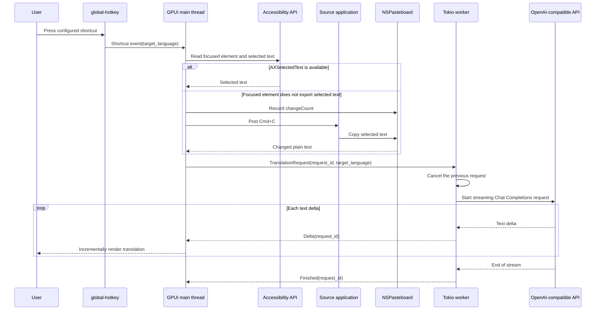

# GlossShift

GlossShift は、GPUI デスクトップインターフェースとコマンドラインインターフェースを備えた macOS 専用の翻訳アプリケーションです。両方のインターフェースは同じ XDG 設定と認証情報を読み込み、同じ翻訳プロンプトを構築し、OpenAI Chat Completions API を実装する任意のサーバーから Rig を介してテキストをストリーミングします。

## 現在のスコープ

- macOS のみ。
- ネイティブなタイトルバーと自由にリサイズ可能なポップアップを備え、初期サイズと最小サイズを設定できます。
- ポップアップを閉じるとアプリを終了せずに非表示になります。次に設定されたショートカットで再表示され、翻訳が開始されます。
- それぞれにターゲット言語が割り当てられた、設定可能なグローバルショートカット。
- macOS Accessibility API による選択範囲の取得。フォーカスされた要素が選択テキストをエクスポートしない場合は、シミュレートされた `Cmd+C` を送信します。
- 任意の OpenAI 互換 Chat Completions エンドポイントによるストリーミング翻訳。
- デスクトップアプリケーションのアクティブなプロバイダーを使用して 1 つの Markdown ファイルを翻訳する `mdt` スタイルの CLI。
- パイプライン向けのプレーンなストリーミング stdout と、ターミナル向けの Tree-sitter ベースの ANSI Markdown ハイライト。
- ソーステキストと翻訳のためのペイン全体のコピーコントロール。
- `~/.config/glossshift` 配下のプレーンテキストの TOML 設定。
- ローカルモデルや llama の統合はありません。

## 要件

- macOS。
- Cargo を備えた Rust 1.85 以降。現在このリポジトリは Rust 1.95 でビルドされています。
- ビルドされたアプリケーションまたは起動に使用するターミナルによる、直接の選択範囲取得と自動 `Cmd+C` のための Accessibility 権限。
- OpenAI 互換 Chat Completions サーバーが公開する API キーとモデル。

GPUI は `runtime_shaders` フィーチャー付きでビルドされるため、Xcode Command Line Tools で十分であり、フル Xcode インストールのスタンドアロン Metal コンパイラは不要です。

## 実行

```bash
just run
```

安定した macOS アプリケーション ID を得るには、代わりにローカルの `.app` バンドルをビルドして開いてください:

```bash
just package-app
open "target/GlossShift.app"
```

生成されたバンドルは `target` 配下に置かれ、コミットされません。`just package-app` は、最終的なバンドル内容をコピーした後、ローカルのアドホック署名を適用して検証します。macOS がバンドル識別子でアプリケーションを識別できるため、これは Accessibility 権限を付与するための推奨形式です。

最初の起動時に次のファイルが作成されます:

- `~/.config/glossshift/config.toml`
- `~/.config/glossshift/credentials.toml`（モード `0600`）

`credentials.toml` の `replace-me` を置き換え、`config.toml` でプロバイダーとショートカットを調整し、アプリケーションを再起動してください。システム設定で Accessibility 権限を付与し、別のアプリケーションでテキストを選択して、目的のターゲット言語のショートカットを押します。アプリケーションはまず Accessibility で選択範囲を読み取り、その要素が選択テキストをエクスポートしない場合はソースアプリケーションに `Cmd+C` を自動送信します。生成されるデフォルトは Control+Meta+J（設定構文では `Ctrl+Super+KeyJ`）で日本語に翻訳します。macOS では `global-hotkey` は Meta/Command 修飾子を `Super` と呼びます。

アプリケーションのバンドル識別子は `com.totto2727.glossshift` です。グローバルな選択範囲取得を使用する前に、このバンドルに Accessibility 権限を付与してください。

`SOURCE` または `TRANSLATION` の横にある `COPY` コントロールを使用すると、そのペインの全文をシステムクリップボードにコピーできます。GPUI 0.2.2 はすぐに使える選択可能な複数行テキスト要素を提供しないため、マウスによる部分選択は現在のシンプルなポップアップのスコープ外です。

赤い閉じるボタンはウィンドウの状態を終了せずにポップアップを非表示にします。設定された翻訳ショートカットを押すと、同じポップアップが前面に戻り、新しい翻訳が開始されます。

ウィンドウのキーボードショートカットは標準の macOS の慣例に従います:

- `Cmd+Q` はアプリケーションを終了します。
- `Cmd+W` はアプリケーションとグローバル翻訳ショートカットをアクティブにしたまま、ポップアップを非表示にします。
- `Cmd+C` は完全な翻訳テキストをコピーします。
- `Cmd+Shift+C` は完全なソーステキストをコピーします。

## CLI

`gshift` バイナリは `~/.config/glossshift/config.toml` と `credentials.toml` を再利用します。個別のプロバイダー、モデル、プロンプト、トークン設定はありません。ターゲット言語は `--lang` から取得され、`active_provider`、`source_language`、タイムアウト値、プロバイダー固有のリクエストパラメータは共有アプリケーション設定から取得されます。

```bash
just cli README.md --lang ja
```

デフォルトでは、CLI は兄弟ファイルを書き込み、`--force` がない限り既存の出力への上書きを拒否します。MoonBit Markdown の複合拡張子や既存の `ja` または `en` 言語セグメントの置き換えを含む、`mdt` のパス規約に従います。

| 入力 | `--lang ja` の出力 |
| --- | --- |
| `guide.md` | `guide.ja.md` |
| `guide.mbt.md` | `guide.ja.mbt.md` |
| `guide.en.md` | `guide.ja.md` |
| `guide.en.mbt.md` | `guide.ja.mbt.md` |

パイプラインやターミナル表示には `--stdout` を使用します:

```bash
just cli README.md --lang ja --stdout
just cli README.md --lang ja --stdout --color always
```

`--color auto` がデフォルトです。リダイレクトされた stdout はバイト単位でプレーンのまま、プロバイダーの各デルタを即座にストリーミングします。ターミナルの stdout はレスポンスが完了するまでバッファリングされ、その後 `tree-sitter-highlight` と `tree-sitter-md` Markdown クエリの ANSI スタイルでレンダリングされます。`--color never` はターミナル出力をプレーンなまま完全にストリーミングします。`--color always` は stdout がリダイレクトされていても ANSI 出力を有効にします。ファイル出力に ANSI エスケープシーケンスは含まれません。

flake は両方のエントリポイントと再利用可能なオーバーレイを公開します。基盤となるパッケージには両方のバイナリが含まれます。各 flake パッケージは `nix run` 用に適切な `meta.mainProgram` を選択します。

```bash
nix run .#gshift -- README.md --lang ja --stdout
nix run .#glossshift
```

下流の flake は `glossshift.overlays.default` を追加し、`pkgs.glossshift` または `pkgs.gshift` を使用できます。

分離されたローカルテストの場合は、起動前に標準の `XDG_CONFIG_HOME` を設定します。アプリケーションは `glossshift` ディレクトリを自動的に追加します:

```bash
XDG_CONFIG_HOME=/tmp/glossshift-test just run
```

## 設定

[`examples/config.toml`](examples/config.toml) と [`examples/credentials.toml`](examples/credentials.toml) を参照してください。プロバイダーと認証情報は名前でリンクされるため、トークンは通常の設定から分離されたままです。

```toml
active_provider = "default"

[providers.default]
base_url = "https://api.openai.com/v1"
model = "gpt-4.1-mini"
credential = "default"
first_chunk_timeout_seconds = 15
stream_idle_timeout_seconds = 30

[translation]
source_language = "auto"

[[shortcuts]]
keys = "Ctrl+Super+KeyJ"
target_language = "Japanese"

[[shortcuts]]
keys = "Ctrl+Super+KeyE"
target_language = "English"
```

ターゲット言語ごとに 1 つの `[[shortcuts]]` テーブルを追加します。各エントリには一意の `keys` 値と空でない `target_language` が必要です。重複したホットキーは、別の言語を暗黙的に置き換える代わりに起動時に失敗します。プロバイダーの base URL にはプロバイダーの API プレフィックス（通常は `/v1`）を含める必要があります。Rig が Chat Completions ルートを追加します。ショートカット名は `global-hotkey` パーサーに従います。修飾子はキーの前に置く必要があります。例: `Ctrl+Super+KeyJ`。

プロバイダー固有の Chat Completions フィールドは TOML テーブルとして追加でき、Rig を通じて変更されずに転送されます。OpenAI の `none` effort をサポートする推論モデルの場合は、次のレイテンシ優先の設定を使用します:

```toml
[providers.default.request_parameters]
reasoning_effort = "none"
```

`reasoning_effort` を拒否するモデルや `none` をサポートしないモデルにはこれを設定しないでください。デフォルトの `gpt-4.1-mini` 設定はすでに非推論であり、したがってこのパラメータを省略します。設定を編集した後は、アクティブなプロバイダーを再起動する必要があります。

## アーキテクチャ

再利用可能なライブラリは XDG 設定、プロンプト構築、プロバイダーストリーミングを担当します。デスクトップバイナリは GPUI、グローバルショートカット、macOS の選択範囲取得を追加します。CLI バイナリはファイル/stdout 処理とオプションの Markdown ハイライトを追加します。GPUI メインスレッドはウィンドウ、グローバルホットキーマネージャー、UI 状態、共有の 2 ワーカー Tokio ランタイムを所有します。Tokio に依存するライブラリは、追加のオーナースレッドを作成せずにそのランタイム上で非同期処理を実行します。有界チャネルは UI および CLI のコンシューマーをネットワーク処理から分離します。単調増加するリクエスト ID により、キャンセルされた、または遅延したデスクトップストリームが新しい翻訳を上書きするのを防ぎます。

```mermaid
flowchart LR
    A["Language-specific global shortcut"] --> B["Bounded channel: target language"]
    B --> C["GPUI main thread"]
    C --> D["macOS Accessibility API"]
    D --> E{"Selected text available?"}
    E -->|"Yes"| H["Captured source text"]
    E -->|"No"| F["Post Cmd+C with Core Graphics"]
    F --> G["Wait for NSPasteboard change"]
    G --> H
    H --> I["Bounded request channel"]
    I --> J["Shared Tokio runtime"]
    J --> K["Rig CompletionsClient"]
    K --> L["OpenAI-compatible /chat/completions stream"]
    L --> M["Request-scoped deltas"]
    M --> N["Bounded UI event channel"]
    N --> C
    O["CLI file + --lang"] --> P["Shared XDG config and prompt"]
    P --> J
    M --> Q{"CLI output mode"}
    Q -->|"File"| R["Sibling .lang.md or .lang.mbt.md"]
    Q -->|"Plain stdout"| S["Stream deltas directly"]
    Q -->|"TTY color"| T["tree-sitter-md + ANSI"]
```





## エラー動作

- 新しいショートカットは以前のストリームをキャンセルします。
- 古いリクエスト ID からのイベントは無視されます。
- 最初のチャンクとその後のアイドル期間には、個別に設定可能なタイムアウトが使用されます。
- Accessibility 権限の欠如、選択テキストの欠如、無効な設定、プロバイダーの障害は、ポップアップに表示されるか、起動時に報告されます。
- 権限が利用可能な状態で Accessibility の選択範囲取得が失敗した場合、アプリケーションは `Cmd+C` を送信し、ポップアップを表示する前に新しい空でないプレーンテキストのペーストボード値を最大 300 ミリ秒待機します。
- 自動取得も失敗した場合、ポップアップは古いクリップボード値を翻訳する代わりに取得エラーを報告します。
- トークンが `Debug` 出力に含まれることはありませんが、現在の認証情報ストアは依然としてプレーンテキストです。Keychain 統合は意図的に先延ばしにされています。

## 開発

```bash
just fix
just check
just ci
just package-app
just cli README.md --lang ja
```

`just fix` は `fix-*` レシピを集約し、`just check` は `check-*` レシピを集約し、`just ci` はチェック、テスト、ビルドを実行します。リポジトリの自動化はルートの `Justfile` に属します。ワークフローがレシピとして合理的に表現できない場合を除き、スタンドアロンのシェルスクリプトを導入する代わりに Just レシピを追加してください。

ソースファイルは小さく保たれ、責任ごとに分離されています: 設定、Accessibility の選択範囲取得、プロンプト構築、ストリーミングワーカー、GPUI ビュー、アプリケーションの配線。

## ドキュメント翻訳

`README.md` と `AGENTS.md` はソースドキュメントです。ローカルの `mdt` コマンドで日本語翻訳を再生成します:

```bash
mdt --lang ja --force README.md
mdt --lang ja --force AGENTS.md
```

生成された `README.ja.md` と `AGENTS.ja.md` をソースの横にコミットしてください。

## 公式リファレンス

- [GPUI crate documentation](https://docs.rs/gpui/0.2.2/gpui/)
- [GPUI source in Zed](https://github.com/zed-industries/zed/tree/main/crates/gpui)
- [Rig installation](https://www.rig.rs/docs/installation)
- [Rig streaming](https://www.rig.rs/docs/concepts/streaming)
- [Rig OpenAI provider](https://www.rig.rs/docs/integrations/model_providers/openai)
- [`global-hotkey` crate documentation](https://docs.rs/global-hotkey/0.8.0/global_hotkey/)
- [`accessibility` crate documentation](https://docs.rs/accessibility/0.2.0/accessibility/)
- [`macos-accessibility-client` crate documentation](https://docs.rs/macos-accessibility-client/0.0.2/macos_accessibility_client/)
- [`core-graphics` crate documentation](https://docs.rs/core-graphics/0.24.0/core_graphics/)
- [`objc2-app-kit` pasteboard documentation](https://docs.rs/objc2-app-kit/0.3.2/objc2_app_kit/struct.NSPasteboard.html)
- [`xdg` crate documentation](https://docs.rs/xdg/3.0.0/xdg/)
- [`tree-sitter-highlight` crate documentation](https://docs.rs/tree-sitter-highlight/latest/tree_sitter_highlight/)
- [`tree-sitter-md` crate documentation](https://docs.rs/tree-sitter-md/latest/tree_sitter_md/)
- [Apple Accessibility trust API](https://developer.apple.com/documentation/applicationservices/1459186-axisprocesstrustedwithoptions)

## ライセンス

MIT