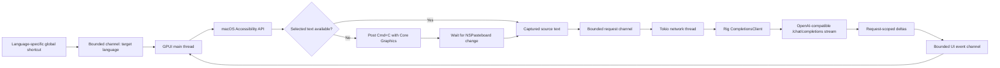
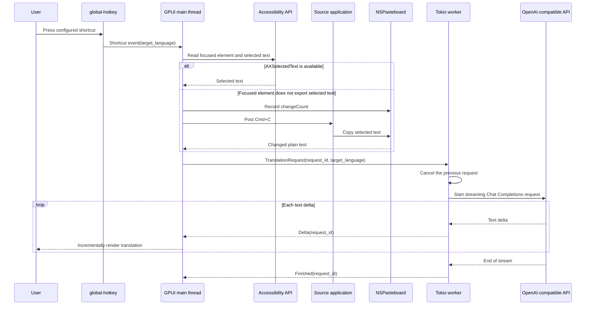

# Translate Popup

Translate Popup は、任意のアプリケーションで選択されたテキストを翻訳し、その結果をリサイズ可能な GPUI ポップアップに表示する macOS 専用のデスクトップアプリケーションです。設定可能なグローバルショートカットで対象言語を選択して翻訳を開始し、Rig が OpenAI Chat Completions API を実装する任意のサーバーからテキストをストリーミングします。

## 現在のスコープ

- macOS のみ。
- ネイティブのタイトルバーと自由にリサイズ可能なポップアップ。初期サイズと最小サイズを設定可能。
- ポップアップを閉じるとアプリを終了せずに非表示にするだけ。次の設定済みショートカットで再表示し、翻訳を開始します。
- 設定可能なグローバルショートカット。各ショートカットにターゲット言語が割り当てられます。
- macOS Accessibility API による選択範囲の取得。フォーカスされた要素が選択テキストを出力しない場合は、続けて `Cmd+C` をシミュレートします。
- 任意の OpenAI 互換 Chat Completions エンドポイントによるストリーミング翻訳。
- ソーステキストと翻訳のペイン全体をコピーするコントロール。
- `~/.config/translate-popup` 配下のプレーンテキスト TOML 設定。
- ローカルモデルや llama 統合はなし。

## 要件

- macOS。
- Cargo を備えた Rust 1.85 以降。リポジトリは現在 Rust 1.95 でビルドされています。
- ビルドされたアプリケーションまたは起動に使用するターミナルに対する、直接の選択範囲取得と自動 `Cmd+C` のための Accessibility 権限。
- OpenAI 互換の Chat Completions サーバーが公開する API キーとモデル。

GPUI は `runtime_shaders` 機能付きでビルドされるため、Xcode Command Line Tools で十分であり、完全な Xcode インストールに含まれるスタンドアロンの Metal コンパイラは不要です。

## 実行

```bash
just run
```

安定した macOS アプリケーションとしての識別情報を得るには、ローカルの `.app` バンドルをビルドして開きます:

```bash
just package-app
open "target/Translate Popup.app"
```

生成されたバンドルは `target` 配下に置かれ、コミットされません。`just package-app` は、最終的なバンドル内容をコピーした後にローカルのアドホック署名を適用して検証します。macOS がアプリケーションをバンドル識別子で識別できるため、これは Accessibility 権限を付与するための推奨形式です。

初回起動時に以下のファイルが作成されます:

- `~/.config/translate-popup/config.toml`
- `~/.config/translate-popup/credentials.toml`(モード `0600`)

`credentials.toml` の `replace-me` を置き換え、`config.toml` のプロバイダーとショートカットを調整し、アプリケーションを再起動します。システム設定で Accessibility 権限を付与し、別のアプリケーションでテキストを選択して、目的のターゲット言語のショートカットを押します。アプリケーションはまず Accessibility で選択範囲を読み取り、その要素が選択テキストを出力しない場合はソースアプリケーションへ `Cmd+C` を自動送信します。生成されるデフォルトは Control+Meta+J(`Ctrl+Super+KeyJ`、設定構文)で日本語に翻訳します。macOS では `global-hotkey` は Meta/Command 修飾キーを `Super` と呼びます。

`SOURCE` または `TRANSLATION` の横にある `COPY` コントロールを使用して、そのペインの完全なテキストをシステムクリップボードにコピーします。GPUI 0.2.2 にはすぐに使える選択可能な複数行テキスト要素がないため、マウスによる部分的な選択は現在のシンプルなポップアップのスコープ外です。

赤い閉じるボタンはウィンドウの状態を終了させずにポップアップを非表示にします。設定済みの翻訳ショートカットを押すと、同じポップアップが再び前面に表示され、新しい翻訳が開始されます。

ウィンドウのキーボードショートカットは macOS の標準的な慣例に従います:

- `Cmd+Q` はアプリケーションを終了します。
- `Cmd+W` はポップアップを非表示にしますが、アプリケーションとグローバル翻訳ショートカットは有効のままです。
- `Cmd+C` は翻訳済みテキストの全体をコピーします。
- `Cmd+Shift+C` はソーステキストの全体をコピーします。

分離されたローカルテストを行うには、起動前に標準の `XDG_CONFIG_HOME` を設定します。アプリケーションは `translate-popup` ディレクトリを自動的に追加します:

```bash
XDG_CONFIG_HOME=/tmp/translate-popup-test just run
```

## 設定

[`examples/config.toml`](examples/config.toml) と [`examples/credentials.toml`](examples/credentials.toml) を参照してください。プロバイダーとクレデンシャルは名前で関連付けられるため、トークンは通常の設定から分離されたままです。

```toml
active_provider = "default"

[providers.default]
base_url = "https://api.openai.com/v1"
model = "gpt-4.1-mini"
credential = "default"
first_chunk_timeout_seconds = 15
stream_idle_timeout_seconds = 30

[translation]
source_language = "auto"

[[shortcuts]]
keys = "Ctrl+Super+KeyJ"
target_language = "Japanese"

[[shortcuts]]
keys = "Ctrl+Super+KeyE"
target_language = "English"
```

ターゲット言語ごとに 1 つの `[[shortcuts]]` テーブルを追加します。各エントリには一意の `keys` 値と空でない `target_language` が必要です。重複するホットキーは別の言語を暗黙的に置き換えるのではなく、起動時に失敗します。プロバイダーのベース URL にはプロバイダーの API プレフィックス(通常は `/v1`)を含める必要があります。Rig が Chat Completions ルートを追加します。ショートカット名は `global-hotkey` のパーサーに従います。修飾キーはキーの前になければなりません。例: `Ctrl+Super+KeyJ`。

プロバイダー固有の Chat Completions フィールドは TOML テーブルとして追加でき、Rig を通じてそのまま転送されます。OpenAI の `none` effort をサポートする推論モデルでは、次のレイテンシ優先設定を使用します:

```toml
[providers.default.request_parameters]
reasoning_effort = "none"
```

`reasoning_effort` を拒否するモデルや `none` をサポートしないモデルにはこれを設定しないでください。デフォルトの `gpt-4.1-mini` 構成はすでに非推論であり、そのためパラメータを省略しています。設定を編集した後は、アクティブなプロバイダーを再起動する必要があります。

## アーキテクチャ

GPUI メインスレッドがウィンドウ、グローバルホットキーマネージャー、UI 状態を所有します。専用の Tokio ランタイムスレッドが LLM のネットワーク処理を所有します。境界のあるチャネルが 2 つのランタイムを分離します。単調増加するリクエスト ID により、キャンセルされたストリームや遅延したストリームが新しい翻訳を上書きするのを防ぎます。





## エラー動作

- 新しいショートカットは以前のストリームをキャンセルします。
- 古いリクエスト ID からのイベントは無視されます。
- 最初のチャンクとその後のアイドル期間には、それぞれ個別に設定可能なタイムアウトを使用します。
- Accessibility 権限の欠如、選択テキストの欠如、無効な設定、プロバイダーの障害は、ポップアップに表示されるか、起動時に報告されます。
- 権限が利用可能な状態で Accessibility の選択範囲取得が失敗した場合、アプリケーションは `Cmd+C` を送信し、ポップアップを表示する前に新しい空でないプレーンテキストのペーストボード値が現れるのを最大 300 ミリ秒待ちます。
- 自動キャプチャも失敗した場合、ポップアップは古いクリップボード値を翻訳する代わりにキャプチャエラーを報告します。
- トークンは `Debug` 出力に含まれることはありませんが、現在のクレデンシャルストアは依然としてプレーンテキストです。Keychain 統合は意図的に先延ばしにされています。

## 開発

```bash
just fix
just check
just ci
just package-app
```

`just fix` は `fix-*` レシピをまとめ、`just check` は `check-*` レシピをまとめ、`just ci` はチェック、テスト、ビルドを実行します。リポジトリの自動化はルートの `Justfile` に属します。ワークフローがレシピとして合理的に表現できない場合を除き、スタンドアロンのシェルスクリプトを導入する代わりに Just レシピを追加してください。

ソースファイルは小さく保たれ、役割ごとに分離されています: 設定、Accessibility の選択範囲取得、プロンプト構築、ストリーミングワーカー、GPUI ビュー、アプリケーションの配線です。

## ドキュメントの翻訳

`README.md` と `AGENTS.md` がソースドキュメントです。ローカルの `mdt` コマンドで日本語翻訳を再生成します:

```bash
mdt --lang ja --force README.md
mdt --lang ja --force AGENTS.md
```

生成された `README.ja.md` と `AGENTS.ja.md` をソースの横にコミットしてください。

## 公式リファレンス

- [GPUI crate ドキュメント](https://docs.rs/gpui/0.2.2/gpui/)
- [Zed 内の GPUI ソース](https://github.com/zed-industries/zed/tree/main/crates/gpui)
- [Rig のインストール](https://www.rig.rs/docs/installation)
- [Rig のストリーミング](https://www.rig.rs/docs/concepts/streaming)
- [Rig OpenAI プロバイダー](https://www.rig.rs/docs/integrations/model_providers/openai)
- [`global-hotkey` crate ドキュメント](https://docs.rs/global-hotkey/0.8.0/global_hotkey/)
- [`accessibility` crate ドキュメント](https://docs.rs/accessibility/0.2.0/accessibility/)
- [`macos-accessibility-client` crate ドキュメント](https://docs.rs/macos-accessibility-client/0.0.2/macos_accessibility_client/)
- [`core-graphics` crate ドキュメント](https://docs.rs/core-graphics/0.24.0/core_graphics/)
- [`objc2-app-kit` ペーストボードドキュメント](https://docs.rs/objc2-app-kit/0.3.2/objc2_app_kit/struct.NSPasteboard.html)
- [`xdg` crate ドキュメント](https://docs.rs/xdg/3.0.0/xdg/)
- [Apple Accessibility trust API](https://developer.apple.com/documentation/applicationservices/1459186-axisprocesstrustedwithoptions)

## ライセンス

MIT