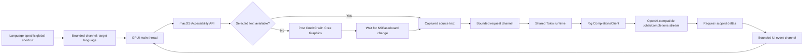
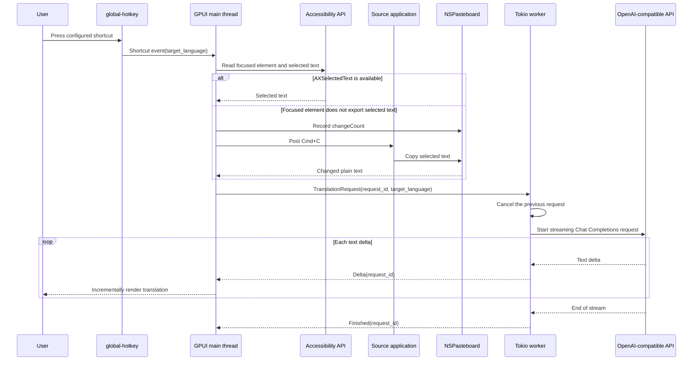

# Translate Popup

Translate Popup は macOS 専用のデスクトップアプリケーションで、任意のアプリケーションで選択したテキストを翻訳し、その結果をリサイズ可能な GPUI ポップアップに表示します。設定可能なグローバルショートカットが対象言語の選択と翻訳の開始を行い、Rig が OpenAI Chat Completions API を実装した任意のサーバーからテキストをストリーミングします。

## 現在のスコープ

- macOS のみ。
- ネイティブなタイトルバーと自由にリサイズ可能なポップアップ。初期サイズと最小サイズを設定できます。
- ポップアップを閉じてもアプリは停止せず、次の設定済みショートカットで再表示され、翻訳が開始されます。
- 対象言語ごとに割り当てられた、設定可能なグローバルショートカット。
- macOS Accessibility API による選択範囲の取得。フォーカスされた要素が選択テキストをエクスポートしない場合に、シミュレートされた `Cmd+C` を送信します。
- 任意の OpenAI 互換 Chat Completions エンドポイントによるストリーミング翻訳。
- ソーステキストと翻訳のためのペイン全体コピーコントロール。
- `~/.config/translate-popup` 配下のプレーンテキスト TOML 設定。
- ローカルモデルや llama 統合はありません。

## 要件

- macOS。
- Rust 1.85 以降と Cargo。リポジトリは現在 Rust 1.95 でビルドします。
- 直接の選択範囲取得と自動 `Cmd+C` のための Accessibility 権限。ビルドしたアプリケーション、または起動に使用するターミナルに付与します。
- OpenAI 互換の Chat Completions サーバーによって公開された API キーとモデル。

GPUI は `runtime_shaders` フィーチャー付きでビルドされるため、Xcode Command Line Tools で十分であり、フル Xcode インストールに含まれるスタンドアロンの Metal コンパイラは不要です。

## 実行方法

```bash
just run
```

安定した macOS アプリケーションアイデンティティを得るには、ローカルの `.app` バンドルをビルドして開きます:

```bash
just package-app
open "target/Translate Popup.app"
```

生成されたバンドルは `target` 配下に置かれ、コミットされません。`just package-app` は最終バンドル内容のコピー後にローカルの ad-hoc 署名を適用・検証します。macOS はバンドル識別子でアプリケーションを識別できるため、Accessibility 権限を付与する際にはこの形式が推奨されます。

初回起動時に以下のファイルが作成されます:

- `~/.config/translate-popup/config.toml`
- `~/.config/translate-popup/credentials.toml`(モード `0600`)

`credentials.toml` の `replace-me` を置き換え、`config.toml` のプロバイダーとショートカットを調整し、アプリケーションを再起動してください。システム設定で Accessibility 権限を付与し、別のアプリケーションでテキストを選択して、目的の対象言語のショートカットを押してください。アプリケーションはまず Accessibility を通じて選択範囲を読み取り、その要素が選択テキストをエクスポートしない場合にソースアプリケーションへ `Cmd+C` を自動的に送信します。生成されるデフォルトは Control+Meta+J で日本語に翻訳します(設定構文では `Ctrl+Super+KeyJ`)。macOS では `global-hotkey` は Meta/Command 修飾子を `Super` と呼びます。

`SOURCE` または `TRANSLATION` の横にある `COPY` コントロールを使用すると、そのペインの完全なテキストをシステムクリップボードにコピーできます。GPUI 0.2.2 には既製の選択可能な複数行テキスト要素がないため、マウスによる部分選択は現在のシンプルなポップアップのスコープ外です。

赤い閉じるボタンはポップアップを非表示にするだけで、ウィンドウ状態は終了しません。設定済みの翻訳ショートカットを押すと、同じポップアップがフォアグラウンドに戻り、新しい翻訳が開始されます。

ウィンドウのキーボードショートカットは標準的な macOS の慣習に従います:

- `Cmd+Q` はアプリケーションを終了します。
- `Cmd+W` はポップアップを非表示にしますが、アプリケーションとグローバル翻訳ショートカットはアクティブのままです。
- `Cmd+C` は翻訳済みテキストの全体をコピーします。
- `Cmd+Shift+C` はソーステキストの全体をコピーします。

隔離されたローカルテストのためには、起動前に標準の `XDG_CONFIG_HOME` を設定してください。アプリケーションは `translate-popup` ディレクトリを自動的に追加します:

```bash
XDG_CONFIG_HOME=/tmp/translate-popup-test just run
```

## 設定

[`examples/config.toml`](examples/config.toml) と [`examples/credentials.toml`](examples/credentials.toml) を参照してください。プロバイダーとクレデンシャルは名前で関連付けられるため、トークンは通常の設定から分離されたままです。

```toml
active_provider = "default"

[providers.default]
base_url = "https://api.openai.com/v1"
model = "gpt-4.1-mini"
credential = "default"
first_chunk_timeout_seconds = 15
stream_idle_timeout_seconds = 30

[translation]
source_language = "auto"

[[shortcuts]]
keys = "Ctrl+Super+KeyJ"
target_language = "Japanese"

[[shortcuts]]
keys = "Ctrl+Super+KeyE"
target_language = "English"
```

対象言語ごとに `[[shortcuts]]` テーブルを 1 つ追加します。各エントリには一意の `keys` 値と空でない `target_language` が必要です。重複したホットキーは、別の言語を静かに置き換えるのではなく、起動時に失敗します。プロバイダーのベース URL には、通常 `/v1` であるプロバイダーの API プレフィックスを含める必要があります。Rig は Chat Completions ルートを追加します。ショートカット名は `global-hotkey` パーサーに従います。修飾子はキーより前に置く必要があります。例: `Ctrl+Super+KeyJ`。

プロバイダー固有の Chat Completions フィールドは TOML テーブルとして追加でき、Rig を通じて変更されずに転送されます。OpenAI の `none` effort をサポートする推論モデルの場合は、次のレイテンシ優先の設定を使用してください:

```toml
[providers.default.request_parameters]
reasoning_effort = "none"
```

`reasoning_effort` を拒否するモデルや `none` をサポートしないモデルにはこれを設定しないでください。デフォルトの `gpt-4.1-mini` 設定はすでに非推論モデルであり、したがってこのパラメータを省略します。設定を編集した後、アクティブなプロバイダーを再起動する必要があります。

## アーキテクチャ

GPUI メインスレッドは、ウィンドウ、グローバルホットキーマネージャー、UI 状態、共有の 2 ワーカー Tokio ランタイムを所有します。Tokio 依存ライブラリは、追加のオーナースレッドを作成せずにそのランタイム上で非同期処理を実行します。境界付きチャネルが GPUI 状態をネットワーク処理から分離します。単調増加するリクエスト ID により、キャンセルされたストリームや遅延ストリームが新しい翻訳を上書きするのを防ぎます。





## エラー動作

- 新しいショートカットは前のストリームをキャンセルします。
- 古いリクエスト ID からのイベントは無視されます。
- 最初のチャンクとその後のアイドル期間には、それぞれ個別に設定可能なタイムアウトを使用します。
- Accessibility 権限の欠如、選択テキストの欠如、無効な設定、プロバイダー障害は、ポップアップに表示されるか、起動時に報告されます。
- 権限が利用可能であるのに Accessibility による選択範囲の取得が失敗した場合、アプリケーションは `Cmd+C` を送信し、ポップアップを表示する前に新しい空でないプレーンテキストのペーストボード値が現れるまで最大 300 ミリ秒待機します。
- 自動取得も失敗した場合、ポップアップは古いクリップボード値を翻訳する代わりに、取得エラーを報告します。
- トークンは `Debug` 出力に含まれませんが、現在のクレデンシャルストアは依然としてプレーンテキストです。キーチェーン統合は意図的に先送りされています。

## 開発

```bash
just fix
just check
just ci
just package-app
```

`just fix` は `fix-*` レシピをまとめて実行し、`just check` は `check-*` レシピをまとめて実行し、`just ci` はチェック、テスト、ビルドを実行します。リポジトリの自動化はルートの `Justfile` に属します。ワークフローがレシピとして合理的に表現できない場合を除き、スタンドアロンのシェルスクリプトを導入する代わりに Just レシピを追加してください。

ソースファイルは小さく保たれ、責任ごとに分離されています: 設定、Accessibility 選択範囲取得、プロンプト構築、ストリーミングワーカー、GPUI ビュー、アプリケーション配線です。

## ドキュメント翻訳

`README.md` と `AGENTS.md` がソースドキュメントです。ローカルの `mdt` コマンドで日本語訳を再生成します:

```bash
mdt --lang ja --force README.md
mdt --lang ja --force AGENTS.md
```

生成された `README.ja.md` と `AGENTS.ja.md` をソースの隣にコミットしてください。

## 公式リファレンス

- [GPUI crate ドキュメント](https://docs.rs/gpui/0.2.2/gpui/)
- [Zed 内の GPUI ソース](https://github.com/zed-industries/zed/tree/main/crates/gpui)
- [Rig インストール](https://www.rig.rs/docs/installation)
- [Rig ストリーミング](https://www.rig.rs/docs/concepts/streaming)
- [Rig OpenAI プロバイダー](https://www.rig.rs/docs/integrations/model_providers/openai)
- [`global-hotkey` crate ドキュメント](https://docs.rs/global-hotkey/0.8.0/global_hotkey/)
- [`accessibility` crate ドキュメント](https://docs.rs/accessibility/0.2.0/accessibility/)
- [`macos-accessibility-client` crate ドキュメント](https://docs.rs/macos-accessibility-client/0.0.2/macos_accessibility_client/)
- [`core-graphics` crate ドキュメント](https://docs.rs/core-graphics/0.24.0/core_graphics/)
- [`objc2-app-kit` ペーストボードドキュメント](https://docs.rs/objc2-app-kit/0.3.2/objc2_app_kit/struct.NSPasteboard.html)
- [`xdg` crate ドキュメント](https://docs.rs/xdg/3.0.0/xdg/)
- [Apple Accessibility トラスト API](https://developer.apple.com/documentation/applicationservices/1459186-axisprocesstrustedwithoptions)

## ライセンス

MIT