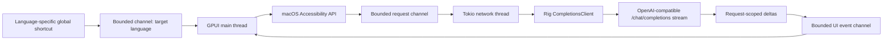
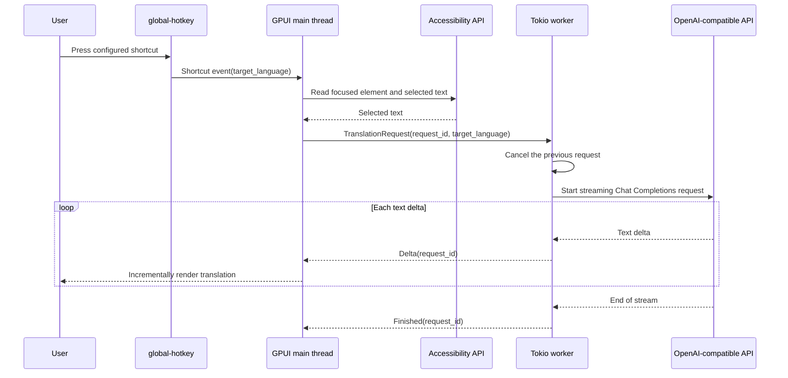

# Translate Popup

Translate Popup は、macOS専用のデスクトップアプリケーションで、任意のアプリケーションで選択されたテキストを翻訳し、結果をリサイズ可能な GPUI ポップアップに表示します。設定可能なグローバルショートカットで対象言語を選択して翻訳を開始し、Rig が OpenAI Chat Completions API を実装した任意のサーバーからテキストをストリーミングします。

## 現在のスコープ

- macOSのみ。
- ネイティブのタイトルバーと自由にリサイズ可能なポップアップ。初期サイズと最小サイズを設定できます。
- ポップアップを閉じるとアプリを停止せずに非表示になり、次に設定したショートカットを押すと再度表示されて翻訳を開始します。
- それぞれが対象言語に割り当てられた設定可能なグローバルショートカット。
- macOS Accessibility API による選択範囲の取得と、テキストクリップボードへのフォールバック。
- 任意の OpenAI 互換 Chat Completions エンドポイントによるストリーミング翻訳。
- 原文と翻訳文をコピーするペイン全体のコピーコントロール。
- `~/.config/translate-popup` 配下のプレーンテキスト TOML 設定。
- ローカルモデルや llama の統合なし。

## 要件

- macOS。
- Rust 1.85 以降と Cargo。このリポジトリは現在 Rust 1.95 でビルドされます。
- ビルドしたアプリケーションまたは起動に使用するターミナルに対する、直接選択範囲取得のための Accessibility 権限。権限がない場合は、ショートカットを押す前にテキストをコピーしてください。
- OpenAI 互換の Chat Completions サーバーが公開する API キーとモデル。

GPUI は `runtime_shaders` フィーチャー付きでビルドされるため、Xcode Command Line Tools で十分であり、フル Xcode インストールに含まれるスタンドアロンの Metal コンパイラは不要です。

## 実行方法

```bash
just run
```

安定した macOS アプリケーションアイデンティティを得るには、ローカルの `.app` バンドルをビルドして開いてください:

```bash
just package-app
open "target/Translate Popup.app"
```

生成されたバンドルは `target` 配下に残り、コミットされません。`just package-app` は、最終的なバンドル内容をコピーした後にローカルの ad-hoc 署名を適用して検証します。macOS がバンドル識別子でアプリケーションを識別できるため、これは Accessibility 権限を付与する際に推奨される形式です。

初回起動時に以下のファイルが作成されます:

- `~/.config/translate-popup/config.toml`
- `~/.config/translate-popup/credentials.toml`(モード `0600`)

`credentials.toml` の `replace-me` を置き換え、`config.toml` のプロバイダーとショートカットを調整し、アプリケーションを再起動してください。直接選択範囲取得の場合は、システム設定で Accessibility 権限を付与し、別のアプリケーションでテキストを選択してから、目的の対象言語のショートカットを押します。権限がない場合、またはフォーカスされた要素が選択テキストを公開しない場合は、テキストをコピーして同じショートカットを押します。アプリケーションは自動的にシステムクリップボードにフォールバックします。生成されるデフォルト設定は Control+Meta+J(設定構文では `Ctrl+Super+KeyJ`)で日本語に翻訳します。macOS では、`global-hotkey` は Meta/Command 修飾キーを `Super` と呼びます。

`SOURCE` または `TRANSLATION` の横にある `COPY` コントロールを使用すると、そのペインの完全なテキストをシステムクリップボードにコピーできます。GPUI 0.2.2 には既製の選択可能な複数行テキスト要素がないため、部分的なマウス選択は現在のシンプルなポップアップのスコープ外です。

赤い閉じるボタンはウィンドウの状態を終了させずにポップアップを非表示にします。設定済みの翻訳ショートカットを押すと、同じポップアップが前面に戻り、新しい翻訳が開始されます。

ウィンドウのキーボードショートカットは標準の macOS 規約に従います:

- `Cmd+Q` はアプリケーションを終了します。
- `Cmd+W` はアプリケーションとグローバル翻訳ショートカットをアクティブにしたままポップアップを非表示にします。
- `Cmd+C` は翻訳済みテキスト全体をコピーします。
- `Cmd+Shift+C` は原文テキスト全体をコピーします。

隔離されたローカルテストには、起動前に標準の `XDG_CONFIG_HOME` を設定してください。アプリケーションは `translate-popup` ディレクトリを自動的に追加します:

```bash
XDG_CONFIG_HOME=/tmp/translate-popup-test just run
```

## 設定

[`examples/config.toml`](examples/config.toml) と [`examples/credentials.toml`](examples/credentials.toml) を参照してください。プロバイダーと認証情報は名前で関連付けられるため、トークンは通常の設定から分離されたままです。

```toml
active_provider = "default"

[providers.default]
base_url = "https://api.openai.com/v1"
model = "gpt-4.1-mini"
credential = "default"
first_chunk_timeout_seconds = 15
stream_idle_timeout_seconds = 30

[translation]
source_language = "auto"

[[shortcuts]]
keys = "Ctrl+Super+KeyJ"
target_language = "Japanese"

[[shortcuts]]
keys = "Ctrl+Super+KeyE"
target_language = "English"
```

対象言語ごとに `[[shortcuts]]` テーブルを 1 つ追加します。各エントリには一意の `keys` 値と空でない `target_language` が必要です。重複したホットキーは、別の言語を黙って置き換える代わりに起動時に失敗します。プロバイダーの base URL には、通常 `/v1` であるプロバイダーの API プレフィックスを含める必要があります。Rig が Chat Completions ルートを追加します。ショートカット名は `global-hotkey` パーサーに従います。修飾キーはキーの前に置く必要があります(例: `Ctrl+Super+KeyJ`)。

プロバイダー固有の Chat Completions フィールドは TOML テーブルとして追加でき、Rig を通じて変更されずに転送されます。OpenAI の `none` エフォートをサポートする推論モデルには、次のレイテンシ優先設定を使用してください:

```toml
[providers.default.request_parameters]
reasoning_effort = "none"
```

`reasoning_effort` を拒否するモデルや `none` をサポートしないモデルにはこれを設定しないでください。デフォルトの `gpt-4.1-mini` 設定はすでに非推論モデルであり、そのためこのパラメータを省略します。設定を編集した後は、アクティブなプロバイダーを再起動する必要があります。

## アーキテクチャ

GPUI メインスレッドがウィンドウ、グローバルホットキーマネージャー、UI 状態を所有します。専用の Tokio ランタイムスレッドが LLM ネットワーク処理を所有します。境界付きチャネルが 2 つのランタイムを分離します。単調増加するリクエスト ID により、キャンセルされたストリームや遅延したストリームが新しい翻訳を上書きするのを防ぎます。





## エラー動作

- 新しいショートカットは以前のストリームをキャンセルします。
- 古いリクエスト ID からのイベントは無視されます。
- 最初のチャンクとその後のアイドル期間には、それぞれ個別に設定可能なタイムアウトが使用されます。
- Accessibility 権限の欠如、選択テキストの欠如、無効な設定、プロバイダーの失敗は、ポップアップに表示されるか、起動時に報告されます。
- Accessibility の選択範囲取得が失敗した場合、空でないテキストクリップボードが使用されます。それ以外の場合、ポップアップはテキストをコピーして再試行するようユーザーに求めます。
- トークンは `Debug` 出力に含まれることはありませんが、現在の認証情報ストアは依然としてプレーンテキストです。キーチェーン統合は意図的に延期されています。

## 開発

```bash
just fix
just check
just ci
just package-app
```

`just fix` は `fix-*` レシピを集約し、`just check` は `check-*` レシピを集約し、`just ci` はチェック、テスト、ビルドを実行します。リポジトリの自動化はルートの `Justfile` に属します。ワークフローがレシピとして合理的に表現できない場合を除き、スタンドアロンのシェルスクリプトを導入する代わりに Just レシピを追加してください。

ソースファイルは小さく保たれ、設定、Accessibility の選択範囲取得、プロンプト構築、ストリーミングワーカー、GPUI ビュー、アプリケーションの配線という役割ごとに分離されています。

## ドキュメントの翻訳

`README.md` と `AGENTS.md` がソースドキュメントです。ローカルの `mdt` コマンドで日本語訳を再生成してください:

```bash
mdt --lang ja --force README.md
mdt --lang ja --force AGENTS.md
```

生成された `README.ja.md` と `AGENTS.ja.md` をソースの隣にコミットしてください。

## 公式リファレンス

- [GPUI クレートドキュメント](https://docs.rs/gpui/0.2.2/gpui/)
- [Zed 内の GPUI ソース](https://github.com/zed-industries/zed/tree/main/crates/gpui)
- [Rig インストール](https://www.rig.rs/docs/installation)
- [Rig ストリーミング](https://www.rig.rs/docs/concepts/streaming)
- [Rig OpenAI プロバイダー](https://www.rig.rs/docs/integrations/model_providers/openai)
- [`global-hotkey` クレートドキュメント](https://docs.rs/global-hotkey/0.8.0/global_hotkey/)
- [`accessibility` クレートドキュメント](https://docs.rs/accessibility/0.2.0/accessibility/)
- [`macos-accessibility-client` クレートドキュメント](https://docs.rs/macos-accessibility-client/0.0.2/macos_accessibility_client/)
- [`xdg` クレートドキュメント](https://docs.rs/xdg/3.0.0/xdg/)
- [Apple Accessibility 信頼 API](https://developer.apple.com/documentation/applicationservices/1459186-axisprocesstrustedwithoptions)

## ライセンス

MIT