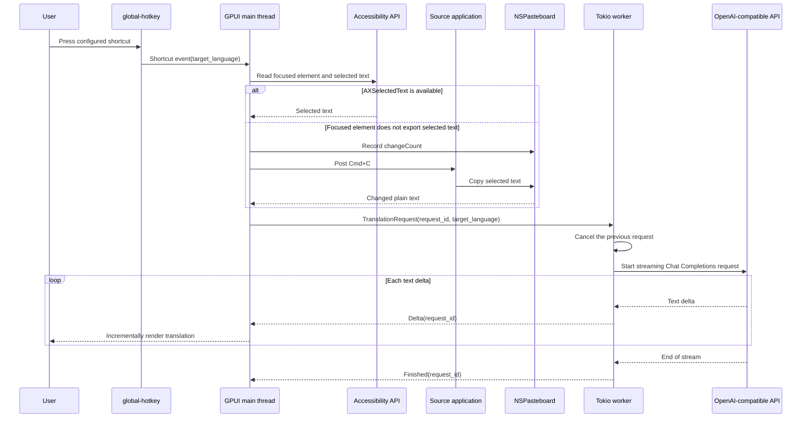

# Translate Popup

Translate Popup は、GPUI デスクトップインターフェースとコマンドラインインターフェースを備えた macOS 専用の翻訳アプリケーションです。両インターフェースは同じ XDG 設定と認証情報を読み込み、同じ翻訳プロンプトを構築し、OpenAI Chat Completions API を実装する任意のサーバーから Rig を通じてテキストをストリーミングします。

## 現在のスコープ

- macOS のみ。
- ネイティブのタイトルバーと自由にリサイズ可能なポップアップ。初期サイズと最小サイズを設定可能。
- ポップアップを閉じてもアプリは終了せず非表示になるだけ。次の設定済みショートカットで再表示され、翻訳が開始される。
- 設定可能なグローバルショートカット。それぞれにターゲット言語が割り当てられる。
- macOS Accessibility API による選択テキストの取得。フォーカスされた要素が選択テキストを公開していない場合は、シミュレートされた `Cmd+C` が続く。
- 任意の OpenAI 互換 Chat Completions エンドポイントによるストリーミング翻訳。
- デスクトップアプリケーションのアクティブプロバイダーを使用して 1 つの Markdown ファイルを翻訳する `mdt` スタイルの CLI。
- パイプライン向けのプレーンなストリーミング stdout と、ターミナル向けの Tree-sitter ベースの ANSI Markdown ハイライト。
- ソーステキストと翻訳のペイン全体をコピーするコントロール。
- `~/.config/translate-popup` 配下のプレーンテキスト TOML 設定。
- ローカルモデルや llama の統合なし。

## 必要条件

- macOS。
- Cargo を備えた Rust 1.85 以降。このリポジトリは現在 Rust 1.95 でビルドされます。
- 直接の選択テキスト取得と自動 `Cmd+C` のための Accessibility 権限（ビルドされたアプリケーションまたは起動に使用するターミナルに付与）。
- OpenAI 互換の Chat Completions サーバーが公開する API キーとモデル。

GPUI は `runtime_shaders` フィーチャー付きでビルドされるため、Xcode Command Line Tools で十分であり、完全な Xcode インストールのスタンドアロン Metal コンパイラは不要です。

## 実行

```bash
just run
```

安定した macOS アプリケーション ID を得るには、代わりにローカルの `.app` バンドルをビルドして開きます：

```bash
just package-app
open "target/Translate Popup.app"
```

生成されたバンドルは `target` 配下に置かれ、コミットされません。`just package-app` は最終的なバンドル内容をコピーした後、ローカルの ad-hoc 署名を適用して検証します。macOS はバンドル ID でアプリケーションを識別できるため、Accessibility 権限を付与する際にはこの形式が推奨されます。

初回起動時に以下のファイルが作成されます：

- `~/.config/translate-popup/config.toml`
- モード `0600` の `~/.config/translate-popup/credentials.toml`

`credentials.toml` の `replace-me` を置き換え、`config.toml` でプロバイダーとショートカットを調整し、アプリケーションを再起動してください。システム設定で Accessibility 権限を許可し、別のアプリケーションでテキストを選択して、目的のターゲット言語のショートカットを押します。アプリケーションはまず Accessibility を通じて選択テキストを読み取り、その要素が選択テキストを公開していない場合はソースアプリケーションに自動的に `Cmd+C` を送信します。生成されるデフォルトは Control+Meta+J（設定構文では `Ctrl+Super+KeyJ`）で日本語に翻訳します。macOS では `global-hotkey` は Meta/Command 修飾キーを `Super` と呼びます。

`SOURCE` または `TRANSLATION` の横にある `COPY` コントロールを使用すると、そのペインの完全なテキストをシステムクリップボードにコピーできます。GPUI 0.2.2 は既製の選択可能な複数行テキスト要素を提供していないため、マウスによる部分選択は現在のシンプルなポップアップのスコープ外です。

赤い閉じるボタンはウィンドウ状態を終了させる代わりにポップアップを非表示にします。設定済みの翻訳ショートカットを押すと、同じポップアップが再びフォアグラウンドに表示され、新しい翻訳が開始されます。

ウィンドウのキーボードショートカットは macOS 標準の慣習に従います：

- `Cmd+Q` でアプリケーションを終了します。
- `Cmd+W` でアプリケーションとグローバル翻訳ショートカットをアクティブのまま、ポップアップを非表示にします。
- `Cmd+C` で翻訳テキスト全体をコピーします。
- `Cmd+Shift+C` でソーステキスト全体をコピーします。

## CLI

`translate-popup-cli` バイナリは `~/.config/translate-popup/config.toml` と `credentials.toml` を再利用します。プロバイダー、モデル、プロンプト、トークンの個別設定はありません。ターゲット言語は `--lang` から取得され、`active_provider`、`source_language`、タイムアウト値、プロバイダー固有のリクエストパラメータは共有のアプリケーション設定から取得されます。

```bash
just cli README.md --lang ja
```

デフォルトでは、CLI は兄弟ファイルを書き込み、`--force` がない限り既存の出力を上書きしません。MoonBit Markdown の複合拡張子や既存の `ja` または `en` 言語セグメントの置き換えを含む、`mdt` のパス規約に従います。

| 入力 | `--lang ja` の出力 |
| --- | --- |
| `guide.md` | `guide.ja.md` |
| `guide.mbt.md` | `guide.ja.mbt.md` |
| `guide.en.md` | `guide.ja.md` |
| `guide.en.mbt.md` | `guide.ja.mbt.md` |

パイプラインやターミナル表示には `--stdout` を使用します：

```bash
just cli README.md --lang ja --stdout
just cli README.md --lang ja --stdout --color always
```

`--color auto` がデフォルトです。リダイレクトされた stdout はバイト単位でプレーンなまま、各プロバイダーデルタを即座にストリーミングします。ターミナルへの stdout はレスポンスが完了するまでバッファリングされ、その後 `tree-sitter-highlight` と `tree-sitter-md` の Markdown クエリによる ANSI スタイルで描画されます。`--color never` はターミナル出力をプレーンのまま完全にストリーミングし、`--color always` は stdout がリダイレクトされていても ANSI 出力を有効にします。ファイル出力に ANSI エスケープシーケンスが含まれることはありません。

flake は両方のエントリポイントと再利用可能なオーバーレイを公開します。基盤となるパッケージには両方のバイナリが含まれます。各 flake パッケージは `nix run` 用に適切な `meta.mainProgram` を選択します。

```bash
nix run .#translate-popup-cli -- README.md --lang ja --stdout
nix run .#translate-popup
```

下流の flake は `translate-popup.overlays.default` を追加し、その後 `pkgs.translate-popup` または `pkgs.translate-popup-cli` を使用できます。

隔離されたローカルテストの場合は、起動前に標準の `XDG_CONFIG_HOME` を設定します。アプリケーションは自動的に自身の `translate-popup` ディレクトリを追加します：

```bash
XDG_CONFIG_HOME=/tmp/translate-popup-test just run
```

## 設定

[`examples/config.toml`](examples/config.toml) と [`examples/credentials.toml`](examples/credentials.toml) を参照してください。プロバイダーと認証情報は名前でリンクされるため、トークンは通常の設定とは別に保たれます。

```toml
active_provider = "default"

[providers.default]
base_url = "https://api.openai.com/v1"
model = "gpt-4.1-mini"
credential = "default"
first_chunk_timeout_seconds = 15
stream_idle_timeout_seconds = 30

[translation]
source_language = "auto"

[[shortcuts]]
keys = "Ctrl+Super+KeyJ"
target_language = "Japanese"

[[shortcuts]]
keys = "Ctrl+Super+KeyE"
target_language = "English"
```

ターゲット言語ごとに 1 つの `[[shortcuts]]` テーブルを追加します。各エントリには一意の `keys` 値と空でない `target_language` が必要です。重複したホットキーは別の言語を黙って置き換える代わりに起動時に失敗します。プロバイダーの base URL にはプロバイダーの API プレフィックス（通常は `/v1`）を含める必要があります。Rig が Chat Completions ルートを追加します。ショートカット名は `global-hotkey` パーサーに従います。修飾キーはキーの前にある必要があります（例：`Ctrl+Super+KeyJ`）。

プロバイダー固有の Chat Completions フィールドは TOML テーブルとして追加でき、Rig を通じて変更されずに転送されます。OpenAI の `none` effort をサポートする推論モデルの場合は、次のレイテンシ優先の設定を使用します：

```toml
[providers.default.request_parameters]
reasoning_effort = "none"
```

`reasoning_effort` を拒否するモデルや `none` をサポートしないモデルにはこれを設定しないでください。デフォルトの `gpt-4.1-mini` 設定はすでに非推論モデルであるため、このパラメータを省略しています。設定を編集した後は、アクティブプロバイダーを再起動する必要があります。

## アーキテクチャ

再利用可能なライブラリは、XDG 設定、プロンプト構築、プロバイダーストリーミングを担当します。デスクトップバイナリは GPUI、グローバルショートカット、macOS の選択テキスト取得を追加し、CLI バイナリはファイル/stdout 処理とオプションの Markdown ハイライトを追加します。GPUI メインスレッドは、ウィンドウ、グローバルホットキーマネージャー、UI 状態、共有の 2 ワーカー Tokio ランタイムを所有します。Tokio に依存するライブラリは、追加のオーナースレッドを作成せずにそのランタイム上で非同期処理を実行します。境界付きチャネルは、UI と CLI のコンシューマーをネットワーク処理から分離します。単調増加するリクエスト ID により、キャンセルされたり遅れて到着したデスクトップストリームが新しい翻訳を上書きするのを防ぎます。





```mermaid
flowchart LR
    A["Language-specific global shortcut"] --> B["Bounded channel: target language"]
    B --> C["GPUI main thread"]
    C --> D["macOS Accessibility API"]
    D --> E{"Selected text available?"}
    E -->|"Yes"| H["Captured source text"]
    E -->|"No"| F["Post Cmd+C with Core Graphics"]
    F --> G["Wait for NSPasteboard change"]
    G --> H
    H --> I["Bounded request channel"]
    I --> J["Shared Tokio runtime"]
    J --> K["Rig CompletionsClient"]
    K --> L["OpenAI-compatible /chat/completions stream"]
    L --> M["Request-scoped deltas"]
    M --> N["Bounded UI event channel"]
    N --> C
    O["CLI file + --lang"] --> P["Shared XDG config and prompt"]
    P --> J
    M --> Q{"CLI output mode"}
    Q -->|"File"| R["Sibling .lang.md or .lang.mbt.md"]
    Q -->|"Plain stdout"| S["Stream deltas directly"]
    Q -->|"TTY color"| T["tree-sitter-md + ANSI"]
```

## エラー動作

- 新しいショートカットは以前のストリームをキャンセルします。
- 古いリクエスト ID からのイベントは無視されます。
- 最初のチャンクとその後のアイドル期間には、それぞれ個別に設定可能なタイムアウトが使用されます。
- Accessibility 権限の欠如、選択テキストの欠如、無効な設定、プロバイダー障害は、ポップアップに表示されるか、起動時に報告されます。
- Accessibility の選択テキスト取得が権限が利用可能な状態で失敗した場合、アプリケーションは `Cmd+C` を送信し、ポップアップを表示する前に最大 300 ミリ秒間、新しい空でないプレーンテキストのペーストボード値を待ちます。
- 自動取得も失敗した場合、ポップアップは古いクリップボード値を翻訳する代わりに取得エラーを報告します。
- トークンは `Debug` 出力に含まれることはありませんが、現在の認証情報ストアは依然としてプレーンテキストです。Keychain 統合は意図的に延期されています。

## 開発

```bash
just fix
just check
just ci
just package-app
just cli README.md --lang ja
```

`just fix` は `fix-*` レシピをまとめ、`just check` は `check-*` レシピをまとめ、`just ci` はチェック、テスト、ビルドを実行します。リポジトリの自動化はルートの `Justfile` に属します。ワークフローがレシピとして合理的に表現できない場合を除き、スタンドアロンのシェルスクリプトを導入する代わりに Just レシピを追加してください。

ソースファイルは小さく保たれ、責務ごとに分離されています：設定、Accessibility の選択テキスト取得、プロンプト構築、ストリーミングワーカー、GPUI ビュー、アプリケーションの配線。

## ドキュメント翻訳

`README.md` と `AGENTS.md` がソースドキュメントです。ローカルの `mdt` コマンドで日本語翻訳を再生成します：

```bash
mdt --lang ja --force README.md
mdt --lang ja --force AGENTS.md
```

生成された `README.ja.md` と `AGENTS.ja.md` をソースの横にコミットします。

## 公式リファレンス

- [GPUI crate documentation](https://docs.rs/gpui/0.2.2/gpui/)
- [GPUI source in Zed](https://github.com/zed-industries/zed/tree/main/crates/gpui)
- [Rig installation](https://www.rig.rs/docs/installation)
- [Rig streaming](https://www.rig.rs/docs/concepts/streaming)
- [Rig OpenAI provider](https://www.rig.rs/docs/integrations/model_providers/openai)
- [`global-hotkey` crate documentation](https://docs.rs/global-hotkey/0.8.0/global_hotkey/)
- [`accessibility` crate documentation](https://docs.rs/accessibility/0.2.0/accessibility/)
- [`macos-accessibility-client` crate documentation](https://docs.rs/macos-accessibility-client/0.0.2/macos_accessibility_client/)
- [`core-graphics` crate documentation](https://docs.rs/core-graphics/0.24.0/core_graphics/)
- [`objc2-app-kit` pasteboard documentation](https://docs.rs/objc2-app-kit/0.3.2/objc2_app_kit/struct.NSPasteboard.html)
- [`xdg` crate documentation](https://docs.rs/xdg/3.0.0/xdg/)
- [`tree-sitter-highlight` crate documentation](https://docs.rs/tree-sitter-highlight/latest/tree_sitter_highlight/)
- [`tree-sitter-md` crate documentation](https://docs.rs/tree-sitter-md/latest/tree_sitter_md/)
- [Apple Accessibility trust API](https://developer.apple.com/documentation/applicationservices/1459186-axisprocesstrustedwithoptions)

## ライセンス

MIT