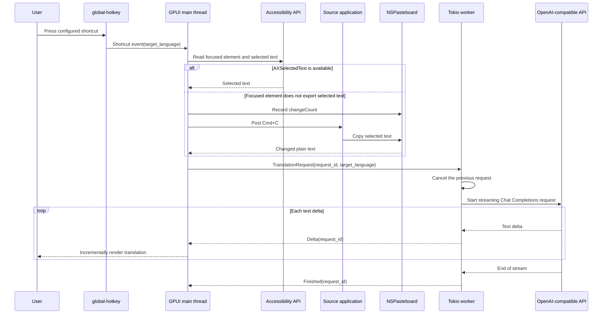

# GlossShift

GlossShift is a macOS-only translation application with GPUI desktop and command-line interfaces. Both interfaces load the same XDG configuration and credentials, build the same translation prompt, and stream text through Rig from any server that implements the OpenAI Chat Completions API.

## Current scope

- macOS only.
- A native title bar and a freely resizable popup, with configurable initial and minimum sizes.
- Closing the popup hides it without stopping the app; the next configured shortcut shows it again and starts translation.
- Configurable global shortcuts, each assigned to a target language.
- Selection capture through the macOS Accessibility API, followed by a simulated `Cmd+C` when the focused element does not export selected text.
- Streaming translation through an arbitrary OpenAI-compatible Chat Completions endpoint.
- An `mdt`-style CLI that translates one or more Markdown files with the desktop application's active provider.
- Plain streamed stdout for pipelines and Tree-sitter-based ANSI Markdown highlighting for terminals.
- Whole-pane copy controls for the source text and translation.
- Plain-text TOML configuration under `~/.config/glossshift`.
- No local model or llama integration.

## Requirements

- macOS.
- Rust 1.85 or newer with Cargo. The repository currently builds with Rust 1.95.
- Accessibility permission for direct selection capture and automatic `Cmd+C` by the built application or terminal used to launch it.
- An API key and model exposed by an OpenAI-compatible Chat Completions server.

GPUI is built with its `runtime_shaders` feature, so Xcode Command Line Tools are sufficient and the standalone Metal compiler from the full Xcode installation is not required.

## Run

```bash
just run
```

For a stable macOS application identity, build a local `.app` bundle and open it instead:

```bash
just package-app
open "target/GlossShift.app"
```

The generated bundle stays under `target` and is not committed. `just package-app` applies and verifies a local ad-hoc signature after copying the final bundle contents. This is the recommended form for granting Accessibility permission because macOS can identify the application by its bundle identifier.

The first launch creates these files:

- `~/.config/glossshift/config.toml`
- `~/.config/glossshift/credentials.toml` with mode `0600`

Replace `replace-me` in `credentials.toml`, adjust the provider and shortcuts in `config.toml`, and restart the application. Grant Accessibility permission in System Settings, select text in another application, and press the shortcut for the desired target language. The application first reads the selection through Accessibility and automatically sends `Cmd+C` to the source application when that element does not export selected text. The generated default translates to Japanese with Control+Meta+J (`Ctrl+Super+KeyJ` in the configuration syntax). On macOS, `global-hotkey` calls the Meta/Command modifier `Super`.

The application bundle identifier is `com.totto2727.glossshift`. Grant Accessibility permission to this bundle before using global selection capture.

Use the `COPY` control beside `SOURCE` or `TRANSLATION` to copy that pane's complete text to the system clipboard. GPUI 0.2.2 does not provide a ready-made selectable multiline text element, so partial mouse selection is outside the current simple popup scope.

The red close button hides the popup instead of terminating its window state. Pressing any configured translation shortcut brings the same popup back to the foreground and starts a new translation.

Window keyboard shortcuts follow standard macOS conventions:

- `Cmd+Q` quits the application.
- `Cmd+W` hides the popup while leaving the application and global translation shortcuts active.
- `Cmd+C` copies the complete translated text.
- `Cmd+Shift+C` copies the complete source text.

## CLI

The `gshift` binary reuses `~/.config/glossshift/config.toml` and `credentials.toml`; it does not have separate provider, model, prompt, or token settings. The target language comes from `--lang`, while `active_provider`, `source_language`, timeout values, and provider-specific request parameters come from the shared application configuration.

```bash
just cli README.md --lang ja
just cli README.md AGENTS.md --lang ja
```

The CLI accepts one or more Markdown files. By default, it writes a sibling file for each input and refuses to overwrite an existing output unless `--force` is present. It follows the `mdt` path convention, including MoonBit Markdown compound extensions and replacement of existing `ja` or `en` language segments.

| Input | `--lang ja` output |
| --- | --- |
| `guide.md` | `guide.ja.md` |
| `guide.mbt.md` | `guide.ja.mbt.md` |
| `guide.en.md` | `guide.ja.md` |
| `guide.en.mbt.md` | `guide.ja.mbt.md` |

Use `--stdout` for pipelines or terminal display:

```bash
just cli README.md --lang ja --stdout
just cli README.md AGENTS.md --lang ja --stdout --color never
just cli README.md --lang ja --stdout --color always
```

`--stdout` translates files sequentially and emits each translated body without separators, preserving input order. `--color auto` is the default. Redirected stdout stays byte-plain and streams each provider delta immediately. Terminal stdout is buffered until each response completes, then rendered with ANSI styles from `tree-sitter-highlight` and the `tree-sitter-md` Markdown queries. `--color never` keeps terminal output plain and fully streamed; `--color always` enables ANSI output even when stdout is redirected. File output never contains ANSI escape sequences.

The flake exposes both entry points and a reusable overlay. The underlying package contains both binaries; each flake package selects the appropriate `meta.mainProgram` for `nix run`.

```bash
nix run .#gshift -- README.md --lang ja --stdout
nix run .#glossshift
```

Downstream flakes can add `glossshift.overlays.default` and then use `pkgs.glossshift` or `pkgs.gshift`.

For an isolated local test, set the standard `XDG_CONFIG_HOME` before launching. The application appends its `glossshift` directory automatically:

```bash
XDG_CONFIG_HOME=/tmp/glossshift-test just run
```

## Configuration

See [`examples/config.toml`](examples/config.toml) and [`examples/credentials.toml`](examples/credentials.toml). Providers and credentials are linked by name, so the token remains separate from the ordinary configuration.

```toml
active_provider = "default"

[providers.default]
base_url = "https://api.openai.com/v1"
model = "gpt-4.1-mini"
credential = "default"
first_chunk_timeout_seconds = 15
stream_idle_timeout_seconds = 30

[translation]
source_language = "auto"

[[shortcuts]]
keys = "Ctrl+Super+KeyJ"
target_language = "Japanese"

[[shortcuts]]
keys = "Ctrl+Super+KeyE"
target_language = "English"
```

Add one `[[shortcuts]]` table for each target language. Each entry requires a unique `keys` value and a non-empty `target_language`; duplicate hotkeys fail at startup instead of silently replacing another language. The provider base URL must include the provider's API prefix, commonly `/v1`. Rig appends the Chat Completions route. Shortcut names follow the `global-hotkey` parser; modifiers must precede the key, for example `Ctrl+Super+KeyJ`.

Provider-specific Chat Completions fields can be added as a TOML table and are forwarded unchanged through Rig. For a reasoning model that supports OpenAI's `none` effort, use the following latency-first setting:

```toml
[providers.default.request_parameters]
reasoning_effort = "none"
```

Do not set this for models that reject `reasoning_effort` or do not support `none`. The default `gpt-4.1-mini` configuration is already non-reasoning and therefore omits the parameter. The active provider must be restarted after editing the configuration.

## Architecture

The reusable library owns XDG configuration, prompt construction, and provider streaming. The desktop binary adds GPUI, global shortcuts, and macOS selection capture; the CLI binary adds file/stdout handling and optional Markdown highlighting. The GPUI main thread owns the window, global hotkey manager, UI state, and a shared two-worker Tokio runtime. Tokio-dependent libraries run their asynchronous work on that runtime without creating an additional owner thread. Bounded channels isolate UI and CLI consumers from network work. A monotonically increasing request ID prevents a cancelled or late desktop stream from overwriting a newer translation.

```mermaid
flowchart LR
    A["Language-specific global shortcut"] --> B["Bounded channel: target language"]
    B --> C["GPUI main thread"]
    C --> D["macOS Accessibility API"]
    D --> E{"Selected text available?"}
    E -->|"Yes"| H["Captured source text"]
    E -->|"No"| F["Post Cmd+C with Core Graphics"]
    F --> G["Wait for NSPasteboard change"]
    G --> H
    H --> I["Bounded request channel"]
    I --> J["Shared Tokio runtime"]
    J --> K["Rig CompletionsClient"]
    K --> L["OpenAI-compatible /chat/completions stream"]
    L --> M["Request-scoped deltas"]
    M --> N["Bounded UI event channel"]
    N --> C
    O["CLI file + --lang"] --> P["Shared XDG config and prompt"]
    P --> J
    M --> Q{"CLI output mode"}
    Q -->|"File"| R["Sibling .lang.md or .lang.mbt.md"]
    Q -->|"Plain stdout"| S["Stream deltas directly"]
    Q -->|"TTY color"| T["tree-sitter-md + ANSI"]
```





## Error behavior

- A new shortcut cancels the prior stream.
- Events from stale request IDs are ignored.
- The first chunk and subsequent idle periods use separately configurable timeouts.
- Missing Accessibility permission, missing selected text, invalid configuration, and provider failures are shown in the popup or reported at startup.
- If Accessibility selection capture fails while permission is available, the application sends `Cmd+C` and waits up to 300 milliseconds for a new non-empty plain-text pasteboard value before showing the popup.
- If automatic capture also fails, the popup reports the capture error instead of translating an older clipboard value.
- Tokens are never included in `Debug` output, but the current credential store is still plain text. Keychain integration is intentionally deferred.

## Development

```bash
just fix
just check
just ci
just package-app
just cli README.md --lang ja
```

`just fix` aggregates the `fix-*` recipes, `just check` aggregates the `check-*` recipes, and `just ci` runs checks, tests, and the build. Repository automation belongs in the root `Justfile`. Add a Just recipe instead of introducing a standalone shell script unless the workflow cannot reasonably be expressed as a recipe.

Source files are kept small and separated by responsibility: configuration, Accessibility selection capture, prompt construction, streaming worker, GPUI view, and application wiring.

## Documentation translation

`README.md` and `AGENTS.md` are the source documents. Regenerate Japanese translations with the local `mdt` command:

```bash
mdt --lang ja --force README.md
mdt --lang ja --force AGENTS.md
```

Commit the generated `README.ja.md` and `AGENTS.ja.md` beside their sources.

## Official references

- [GPUI crate documentation](https://docs.rs/gpui/0.2.2/gpui/)
- [GPUI source in Zed](https://github.com/zed-industries/zed/tree/main/crates/gpui)
- [Rig installation](https://www.rig.rs/docs/installation)
- [Rig streaming](https://www.rig.rs/docs/concepts/streaming)
- [Rig OpenAI provider](https://www.rig.rs/docs/integrations/model_providers/openai)
- [`global-hotkey` crate documentation](https://docs.rs/global-hotkey/0.8.0/global_hotkey/)
- [`accessibility` crate documentation](https://docs.rs/accessibility/0.2.0/accessibility/)
- [`macos-accessibility-client` crate documentation](https://docs.rs/macos-accessibility-client/0.0.2/macos_accessibility_client/)
- [`core-graphics` crate documentation](https://docs.rs/core-graphics/0.24.0/core_graphics/)
- [`objc2-app-kit` pasteboard documentation](https://docs.rs/objc2-app-kit/0.3.2/objc2_app_kit/struct.NSPasteboard.html)
- [`xdg` crate documentation](https://docs.rs/xdg/3.0.0/xdg/)
- [`tree-sitter-highlight` crate documentation](https://docs.rs/tree-sitter-highlight/latest/tree_sitter_highlight/)
- [`tree-sitter-md` crate documentation](https://docs.rs/tree-sitter-md/latest/tree_sitter_md/)
- [Apple Accessibility trust API](https://developer.apple.com/documentation/applicationservices/1459186-axisprocesstrustedwithoptions)

## License

MIT
