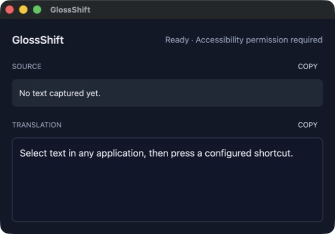

# GlossShift

GlossShift is a macOS translation application with a GPUI desktop popup and a `gshift` command that share OpenAI-compatible providers, prompts, credentials, and streaming behavior.

## Usage

Open the packaged desktop app, select text in any macOS application, and press a configured shortcut. The popup places the captured text in **SOURCE**, streams the result into **TRANSLATION**, and lets you copy either pane.



Translate one or more Markdown files with the packaged CLI:

```bash
nix run 'github:totto2727-org/glossshift#gshift' -- document.md notes.mbt.md --lang ja
```

Write translations to standard output without ANSI styling:

```bash
nix run 'github:totto2727-org/glossshift#gshift' -- document.md --lang ja --stdout --color never
```

On its first invocation, `gshift` creates `config.toml` and `credentials.toml` under the GlossShift XDG configuration directory and exits until the placeholder API key is replaced. After configuration, the first command writes `document.ja.md` and `notes.ja.mbt.md` and reports their paths to standard error; the second command emits the plain translated body to standard output without creating a file. Multiple inputs are always processed in command-line order.

## Key features

- Native macOS popup with global shortcuts, a resizable window, and copy controls for source and translated text.
- Streaming translations through servers that implement the OpenAI Chat Completions API, including custom base URLs and request parameters.
- Shared XDG configuration and credentials for the desktop application and `gshift` CLI.
- Ordered multi-file Markdown translation with sibling-file or standard-output modes.
- Plain streamed output for pipelines and optional Tree-sitter Markdown ANSI highlighting for terminals.
- A separated system prompt and user document so source content remains inert and its structure is translated one-to-one instead of changing the translation contract.
- Request replacement in the desktop popup so a newer shortcut cancels and supersedes an older translation.

## Prerequisites

- **macOS**: GlossShift supports Apple Silicon and Intel macOS through the Darwin flake outputs.
- **Nix with flakes enabled**: The repository currently distributes source-backed `glossshift` and `gshift` flake packages and does not publish release artifacts.
- **OpenAI-compatible provider credentials**: Supply an API key, model, and base URL for a server implementing Chat Completions.
- **Accessibility permission for the desktop app**: Grant access when using global selection capture and its simulated `Cmd+C` fallback.

## Setup

1. Run the CLI against an existing Markdown file. Nix fetches and builds the `gshift` package on first use.

```bash
nix run 'github:totto2727-org/glossshift#gshift' -- document.md --lang ja
```

On the first run, GlossShift creates `~/.config/glossshift/config.toml` and `~/.config/glossshift/credentials.toml`, then exits until the placeholder API key is replaced. If `XDG_CONFIG_HOME` is set, the files are created under `$XDG_CONFIG_HOME/glossshift` instead. GlossShift always resets `credentials.toml` permissions to `0600`.

2. Set the API key for the default named credential in `credentials.toml`.

```toml
[credentials.default]
api_key = "your-api-key"
```

3. Adjust the active provider, model, and shortcuts in `config.toml` when the defaults do not match the provider.

```toml
active_provider = "default"

[providers.default]
base_url = "https://api.openai.com/v1"
model = "gpt-4.1-mini"
credential = "default"
first_chunk_timeout_seconds = 15
stream_idle_timeout_seconds = 30

[translation]
source_language = "auto"

[[shortcuts]]
keys = "Ctrl+Super+KeyJ"
target_language = "Japanese"
```

The provider base URL must include its API prefix, commonly `/v1`, because GlossShift appends the Chat Completions route. Provider names and credential names must match, shortcut keys must be unique, and every target language must be non-empty.

4. Run the CLI command again after saving the credentials and configuration.

5. To use the desktop popup, build the packaged app output and open its stable application bundle, then grant Accessibility permission in System Settings > Privacy & Security > Accessibility.

```bash
nix build --out-link GlossShift-result 'github:totto2727-org/glossshift#glossshift'
open GlossShift-result/Applications/GlossShift.app
```

## API

The supported end-user interfaces are the packaged `GlossShift.app` and `gshift` command. Rust modules exposed in the source package share implementation between those binaries; GlossShift does not publish a separately supported Rust library API or registry reference.

### `gshift`

```text
gshift <FILES>... --lang <LANGUAGE> [--force | --stdout [--color <MODE>]]
```

| Input or option | Meaning |
| --- | --- |
| `<FILES>...` | One or more `.md` or `.mbt.md` files, translated sequentially in the supplied order. |
| `-l`, `--lang <LANGUAGE>` | Required target-language code. It is trimmed, lowercased, and must contain only ASCII letters, digits, and internal hyphens. |
| `-f`, `--force` | Replace existing sibling outputs. This conflicts with `--stdout`. |
| `--stdout` | Concatenate translations to standard output in input order without inserted separators. |
| `--color <auto|always|never>` | Control ANSI Markdown highlighting for `--stdout`; defaults to `auto` and requires `--stdout`. |
| `-h`, `--help` | Print the generated command reference. |
| `-V`, `--version` | Print the installed version. |

Without `--stdout`, `gshift` inserts `.<language>` before `.md`, preserves the compound `.mbt.md` extension, and replaces an existing trailing `.ja` or `.en` language segment. It rejects output paths that collide with an input or another output. Existing files and symbolic links are rejected unless `--force` is set; forced symbolic-link output replaces the link itself without modifying its target.

With `--stdout --color auto`, redirected output is plain and streamed while terminal output is buffered per translation and ANSI-highlighted. `--color never` always streams plain output, and `--color always` emits ANSI styling even when redirected. File outputs never contain ANSI escapes.

Configuration, input, provider, timeout, and output failures are written to standard error with a `gshift failed:` prefix and exit status `1`. Help and version output exit successfully without loading configuration.

```bash
# Replace existing Japanese sibling outputs.
nix run 'github:totto2727-org/glossshift#gshift' -- first.md second.md --lang ja --force

# Stream plain English output for a pipeline.
nix run 'github:totto2727-org/glossshift#gshift' -- document.md --lang en --stdout --color never
```

## Development

For repository structure, architecture, and development commands, see [AGENTS.md](./AGENTS.md).

## License

The package metadata declares MIT, but this repository does not currently include a `LICENSE` file.

_This README was generated from the [share-artifact skill](https://raw.githubusercontent.com/totto2727-org/agent/refs/heads/main/plugins/totto2727-coding/skills/share-artifact/SKILL.md) and [README template](https://raw.githubusercontent.com/totto2727-org/agent/refs/heads/main/plugins/totto2727-coding/skills/share-artifact/readme/template.md)._
