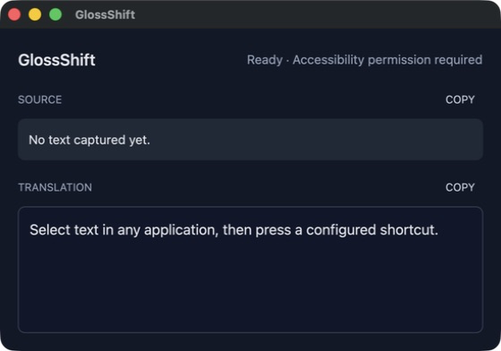

# GlossShift

GlossShift is a macOS translation application with a GPUI desktop popup and a `gshift` command that share OpenAI-compatible providers, prompts, credentials, and streaming behavior.

## Usage

```bash
open ~/.nix-profile/Applications/GlossShift.app
```

Select text in any macOS application and press a configured shortcut. The popup places the captured text in **SOURCE**, streams the result into **TRANSLATION**, and lets you copy either pane.



```bash
gshift document.md notes.mbt.md --lang ja
```

Write translations to standard output without ANSI styling:

```bash
gshift document.md --lang ja --stdout --color never
```

On its first invocation, `gshift` creates its application settings under the GlossShift XDG configuration directory and shared provider settings under `~/.agents`, then exits until the placeholder API key is replaced. After configuration, the first command writes `document.ja.md` and `notes.ja.mbt.md` and reports their paths to standard error; the second command emits the plain translated body to standard output without creating a file. Multiple inputs are always processed in command-line order.

## Key features

- Native macOS popup with global shortcuts, a resizable window, and copy controls for source and translated text.
- Streaming translations through servers that implement the OpenAI Chat Completions API, including custom base URLs and request parameters.
- Application-specific XDG settings plus shared `~/.agents` providers and credentials reusable by other applications through the independent `agents-config` crate.
- Ordered multi-file Markdown translation with sibling-file or standard-output modes.
- Plain streamed output for pipelines and optional Tree-sitter Markdown ANSI highlighting for terminals.
- A separated system prompt and user document so source content remains inert and its structure is translated one-to-one instead of changing the translation contract.
- Request replacement in the desktop popup so a newer shortcut cancels and supersedes an older translation.

## Prerequisites

- **Apple Silicon Mac only**: Intel Macs are not supported.
- **Nix with flakes enabled**
- **OpenAI-compatible provider credentials**: Supply an API key, model, and base URL for a server implementing Chat Completions.
- **Accessibility permission for the desktop app**: Grant access when using global selection capture and its simulated `Cmd+C` fallback.

## Setup

### Run without installing

```bash
nix run 'github:totto2727-org/glossshift#glossshift'
nix run 'github:totto2727-org/glossshift#gshift' -- --help
```

### Install

```bash
nix profile add 'github:totto2727-org/glossshift#glossshift'
nix profile add 'github:totto2727-org/glossshift#gshift'
```

### Nix flake

```nix
{
  inputs = {
    nixpkgs.url = "github:NixOS/nixpkgs/nixpkgs-unstable";
    glossshift.url = "github:totto2727-org/glossshift";
  };

  outputs = { nixpkgs, glossshift, ... }:
    let
      system = "aarch64-darwin";
      pkgs = nixpkgs.legacyPackages.${system};
    in {
      packages.${system}.default = pkgs.buildEnv {
        name = "translation-tools";
        paths = [
          glossshift.packages.${system}.glossshift
          glossshift.packages.${system}.gshift
        ];
      };
    };
}
```

## Configuration

GlossShift keeps translation, shortcut, and window settings in `~/.config/glossshift/config.toml`, or `$XDG_CONFIG_HOME/glossshift/config.toml` when `XDG_CONFIG_HOME` is set.
Provider definitions live separately in `~/.agents/config.toml`, and named API keys live in `~/.agents/credentials.toml` with Unix permissions `0600`.
The independent `agents-config` crate owns loading, validation, credential resolution, and conversion to Rig.
Other applications can read these same files and choose any named provider without depending on GlossShift.

Set `AGENTS_CONFIG` to an absolute configuration-file path to select a different shared configuration.
Its `credentials.toml` is read from the same directory.
The loader does not search the current directory or silently use a project's `.agents` directory, so launching the desktop and CLI from different directories does not change providers.

### Shared providers

For example, `~/.agents/config.toml` can retain both OpenAI and OpenCode Go:

```toml
active_provider = "opencode-go"

[providers.openai]
base_url = "https://api.openai.com/v1"
model = "gpt-4.1-mini"
credential = "openai"
first_chunk_timeout_seconds = 30
stream_idle_timeout_seconds = 60

[providers.opencode-go]
base_url = "https://opencode.ai/zen/go/v1"
model = "kimi-k2.5"
credential = "opencode-go"
first_chunk_timeout_seconds = 30
stream_idle_timeout_seconds = 60

[providers.opencode-go.headers]
x-opencode-session = "${session_id}"
User-Agent = "glossshift/0.2.0"

# Optional provider-specific JSON-compatible request fields:
# [providers.opencode-go.request_parameters]
# reasoning_effort = "none"
```

Choose a Chat Completions model available to your provider account.
The base URL must include its API prefix, such as `/v1` or `/zen/go/v1`.
`active_provider` chooses the provider used by GlossShift, while each provider's `credential` references an entry in the credentials file.
Provider and credential names do not have to be identical.
Both timeout values default to 30 and 60 seconds respectively and must be positive.
Additional request parameters are forwarded through Rig.
`${session_id}` in header values expands to one UUID per translation, shared by all requests within that translation.
Literal values and other placeholders remain unchanged.

Create matching entries in `~/.agents/credentials.toml` and replace the placeholders:

```toml
[credentials.openai]
api_key = "replace-me"

[credentials.opencode-go]
api_key = "replace-me"
```

Never commit this credentials file or real secret header values.

### Application settings

GlossShift's XDG `config.toml` contains only application settings:

```toml
[translation]
source_language = "auto"

[[shortcuts]]
keys = "Ctrl+Super+KeyJ"
target_language = "Japanese"

[window]
width = 560
height = 360
min_width = 320
min_height = 180
```

Shortcut keys must be unique, and every target language must be non-empty.
See `examples/config.toml`, `examples/agents-config.toml`, and `examples/credentials.toml` for starter files.

### Existing installations

When the selected shared configuration does not yet exist, GlossShift imports the legacy provider definitions and active provider from its XDG configuration and copies the legacy credentials if the shared credentials file is absent.
Existing shared files are never overwritten, and the original legacy files are preserved.
Once the shared configuration exists, provider settings in the old GlossShift configuration no longer select or modify the shared provider.
Edit the shared files for future provider changes, then restart the desktop application or rerun the CLI.

## Permissions

Grant the installed `GlossShift.app` access in System Settings > Privacy & Security > Accessibility. This permission lets the global shortcut capture selected text and use the simulated `Cmd+C` fallback when an application does not expose its selection directly.

## API

The supported end-user interfaces are the packaged `GlossShift.app` and `gshift` command. Rust modules exposed in the source package share implementation between those binaries; GlossShift does not publish a separately supported Rust library API or registry reference.

### `gshift`

```text
gshift <FILES>... --lang <LANGUAGE> [--force | --stdout [--color <MODE>]]
```

| Input or option | Meaning |
| --- | --- |
| `<FILES>...` | One or more `.md` or `.mbt.md` files, translated sequentially in the supplied order. |
| `-l`, `--lang <LANGUAGE>` | Required target-language code. It is trimmed, lowercased, and must contain only ASCII letters, digits, and internal hyphens. |
| `-f`, `--force` | Replace existing sibling outputs. This conflicts with `--stdout`. |
| `--stdout` | Concatenate translations to standard output in input order without inserted separators. |
| `--color <auto|always|never>` | Control ANSI Markdown highlighting for `--stdout`; defaults to `auto` and requires `--stdout`. |
| `-h`, `--help` | Print the generated command reference. |
| `-V`, `--version` | Print the installed version. |

Without `--stdout`, `gshift` inserts `.<language>` before `.md`, preserves the compound `.mbt.md` extension, and replaces an existing trailing `.ja` or `.en` language segment. It rejects output paths that collide with an input or another output. Existing files and symbolic links are rejected unless `--force` is set; forced symbolic-link output replaces the link itself without modifying its target.

With `--stdout --color auto`, redirected output is plain and streamed while terminal output is buffered per translation and ANSI-highlighted. `--color never` always streams plain output, and `--color always` emits ANSI styling even when redirected. File outputs never contain ANSI escapes.

Configuration, input, provider, timeout, and output failures are written to standard error with a `gshift failed:` prefix and exit status `1`. Help and version output exit successfully without loading configuration.

```bash
# Replace existing Japanese sibling outputs.
gshift first.md second.md --lang ja --force

# Stream plain English output for a pipeline.
gshift document.md --lang en --stdout --color never
```

## Development

For repository structure, architecture, and development commands, see [AGENTS.md](./AGENTS.md).

## License

The package metadata declares MIT, but this repository does not currently include a `LICENSE` file.

_This README was generated from the [share-artifact skill](https://raw.githubusercontent.com/totto2727-org/agent/refs/heads/main/plugins/totto2727-coding/skills/share-artifact/SKILL.md) and [README template](https://raw.githubusercontent.com/totto2727-org/agent/refs/heads/main/plugins/totto2727-coding/skills/share-artifact/readme/template.md)._
